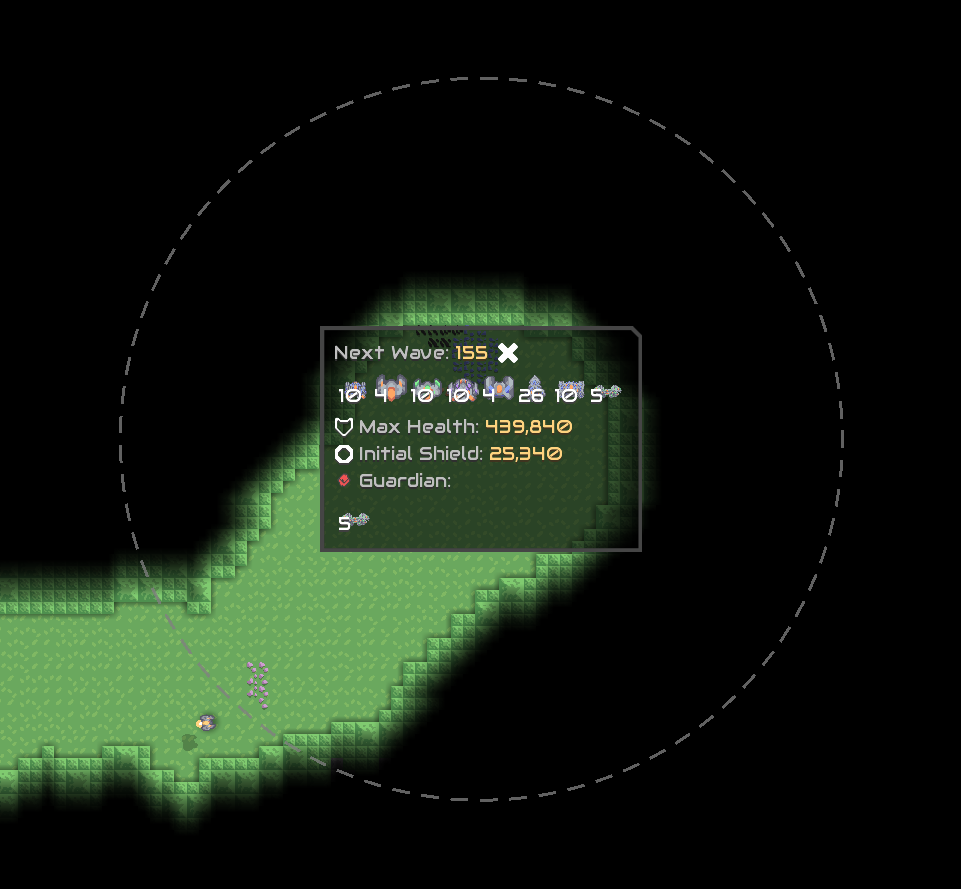
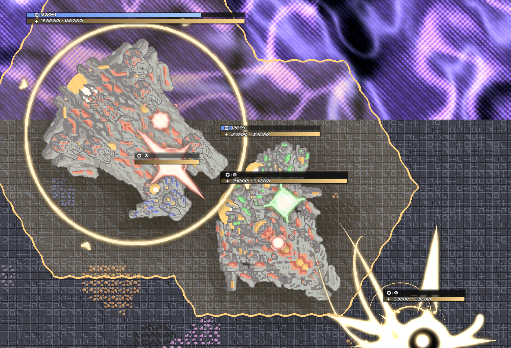

# Fork Log
## v1.4
- Removed annoying turrets related health bars
- Supports Gradle-8.2.1 and Java17 environments
- Compile using Mindustry v146 environment
  
# Range Imager
Show the range of turrets and units.

## Feature
- Specific Shaders are used to make the graphic batter.
- Clear, not in a mess.
- Fluency.
> Display
> 
> 
> 